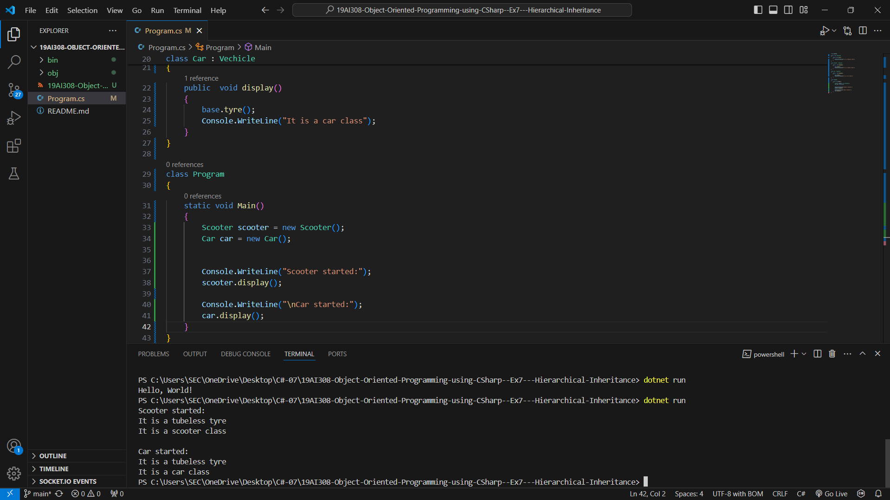

# 19AI308-Object-Oriented-Programming-using-CSharp--Ex7---Hierarchical-Inheritance
# AIM:
To write a C# program to implement heirarchical inheritance for the following problem statement:  All the vehicles need Tyres on their wheels. 
So, the manufacturer designs their vehicle as they want and import Tyre from its base class and fit it into Wheels. 
They don’t need to design Tyre all the time. Once they designed the model and use it various times. 
Aim is to create a Scooter and Car vehicle where the Tyre is being inherited from vehicle class.


# PROGRAM:
```
using System;

public class Vechicle
{
    public void tyre()
    {
        Console.WriteLine("It is a tubeless tyre");
    }
}

class Scooter : Vechicle
{
    public  void display() 
    {
        base.tyre();
        Console.WriteLine("It is a scooter class");
    }
}

class Car : Vechicle
{
    public  void display() 
    {
        base.tyre();
        Console.WriteLine("It is a car class");
    }
}

class Program
{
    static void Main()
    {
        Scooter scooter = new Scooter();
        Car car = new Car();
        
        
        Console.WriteLine("Scooter started:");
        scooter.display();
        
        Console.WriteLine("\nCar started:");
        car.display();
    }
}
```
# OUTPUT:


# RESULT:
Thus the program has been executed successfully.
